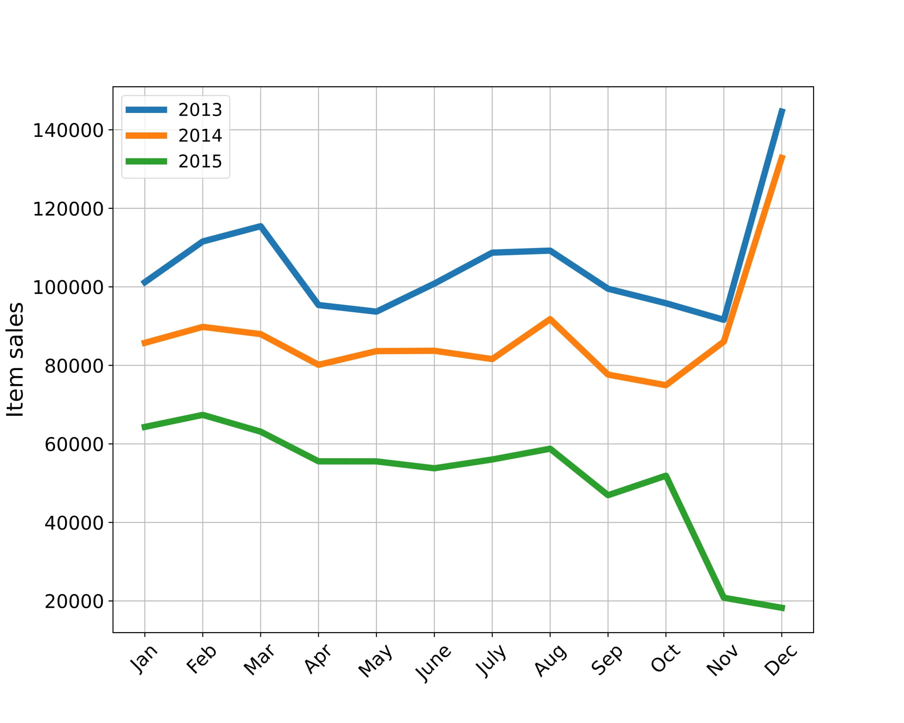
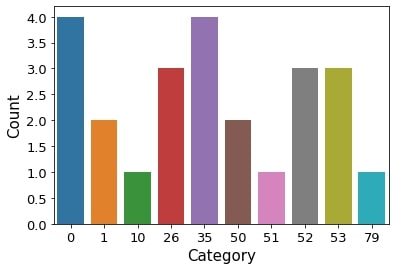
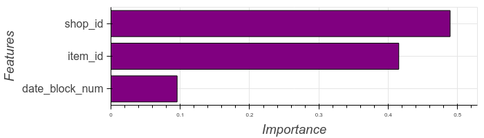
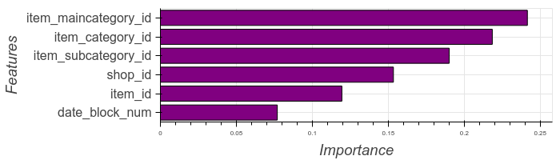
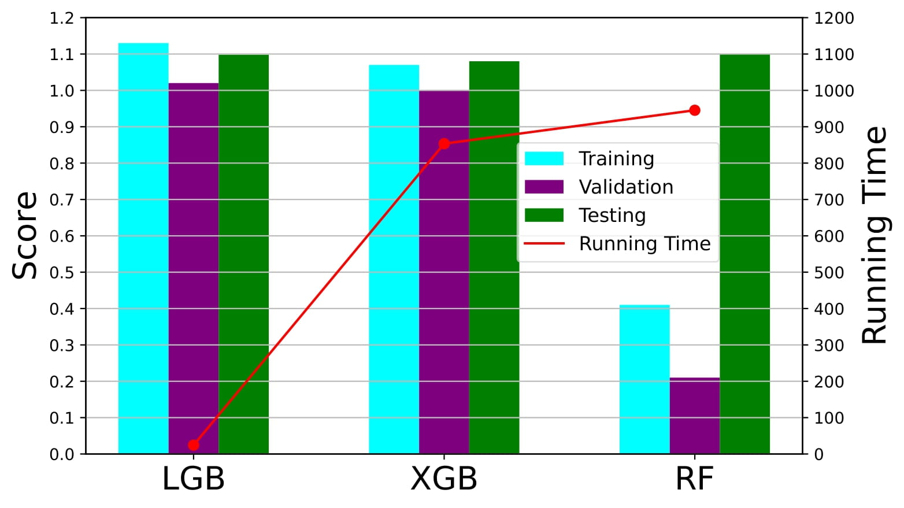

# Predict Future Sales - Kaggle Competition

## Introduction

This project was part of the course "Data Mining" at Leiden University. We participated in the Kaggle competition "Predict Future Sales", where we had to predict total sales for every product and store in the next month. The dataset consists of daily sales data, provided by one of the largest Russian software firms - 1C Company. The task was to predict the total sales for every product and store in the next month. The dataset can be downloaded from [here](https://www.kaggle.com/competitions/competitive-data-science-predict-future-sales).

## Files

The files in this repository are organized as follows:
- `competitive-data-science-predict-future-sales/`: contains the dataset and the files provided by Kaggle.
- `plots/`: contains the plots generated during the EDA and when training the models.
- `Predictionss.ipynb`: Jupyter notebook with the code for the project.
- `submission_lgb.csv`, `submission_lgb_extended.csv`, `submission_random_forest.csv`, `submission_random_forest_extended.csv`, `submission_xgb.csv`, `submission_xgb_extended.csv`: CSV files with the predictions for the test set.
- `report.pdf`: final report of the project, including the results and the analysis.
- `README.md`: this file.

## Dataset

 Each item in the dataset has a unique identifier, which is a tuple of the shop_id and item_id. The dataset also includes:
- item_category_id: unique identifier of item category
- item_cnt_day: number of products sold. 
- item_price: current price of an item
- date: date in format dd/mm/yyyy
- date_block_num: a consecutive month number starting from January 2013 (0) to October 2015 (33)
- item_name: name of item
- shop_name: name of shop
- item_category_name: name of item category

## Methodology

The aim of the assignment was to perform exploratory data analysis (EDA) on the dataset, preprocess the data, and implement several existing forecasting models. We used the following models:
- LGB (Light Gradient Boosting)
- XGB (Extreme Gradient Boosting)
- Random Forest

## Exploratory Data Analysis (EDA) and Preprocessing

Before generating the predictions, we performed EDA on the dataset to understand the distribution of the data and identify any outliers. We also created several plots to visualize the data. The plots below show the total sales per month and the number of items per category.

  
*Total sales per month from January 2013 to October 2015. Each line represents a different year.*

  
*Number of items per category.*

For the preprocessing of the data, we decided to use the last available month (October 2015) as our validation set, to make sure that our model generalizes well to unseen data. We created two different training sets, one with the date_block_num, shop_id, and item_id, and another one that also included the item_category_id, item_maincategory_id, and item_subcategory_id (extended version). For the main and subcategories, we used the LabelEncoder to generate integers that will act as a unique identifier of each of the two names of the item’s category. The Y train includes the values of item_cnt_month, which is the goal of the prediction. These values are clipped between 0 and 20 to remove the outliers and give us better results in our predictions. 

## Results

The models were trained using the training set and validated using the validation set. For the XGB we could also plot the feature importance, which is shown in the figure below.

  
*Feature importance of the XGB model using the training set.*

  
*Same as above, but using the extended version.*

We used the RMSE as the evaluation metric to compare the performance of the models. The results of the models, for the extended version, on the training, validation, and test sets, as well as the training time, are shown in the figure below.

  
*Comparison of the models on the training, validation, and test sets. The RMSE is used as the evaluation metric.*

All the results can be summarized in the table below:

| Model | RMSE Train | RMSE Validation | RMSE Test | Training Time (s) |
| --- | --- | --- | --- | --- |
| LGB | 1.39 | 1.24 | 1.19 | 20.56 |
| LGB Extended | 1.13 | 1.02 | 1.098 | 24.39 |
| XGB | 1.18 | 1.11 | 1.180 | 705.53 |
| XGB Extended | 1.07 | 1.00 | 1.080 | 853.44 |
| Random Forest | - | - | 1.119 | 678.73 |
| Random Forest Extended | - | - | 1.099 | 945.32 |

The final predictions were submitted to the Kaggle competition (RMSE test column) and the best model was the XGB for the extended version. For all the models the extended version performed better than the main version, which shows that the additional features were useful for the predictions. The feature importance plots also showed that the additional features were important for the predictions. The LGB and the Random Forest models had very similar performance, with the LGB being much faster to train, making the Random Forest model less attractive. The XGB model was the best in terms of performance, but it was also slow to train (a bit faster than the Random Forest).
